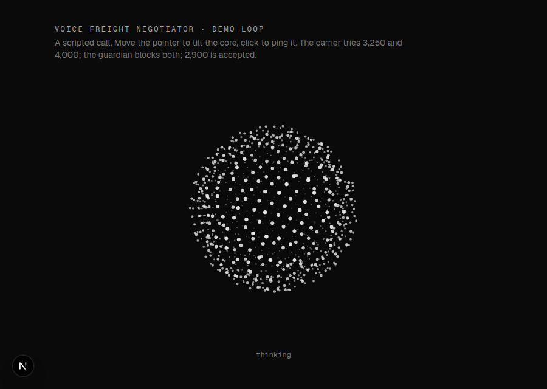
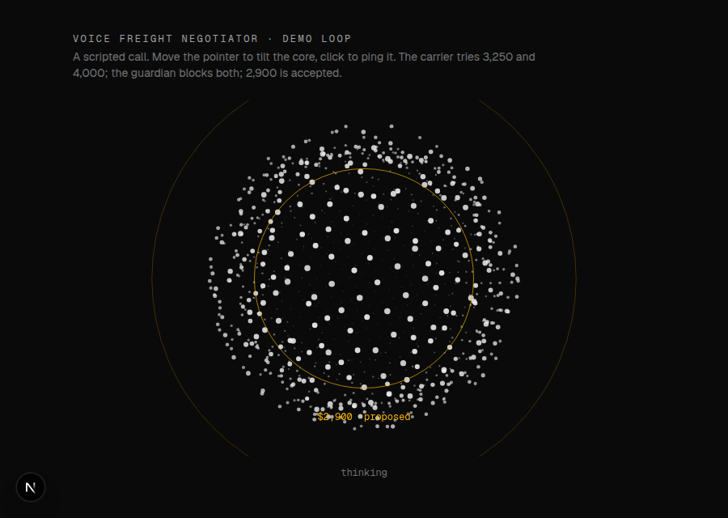
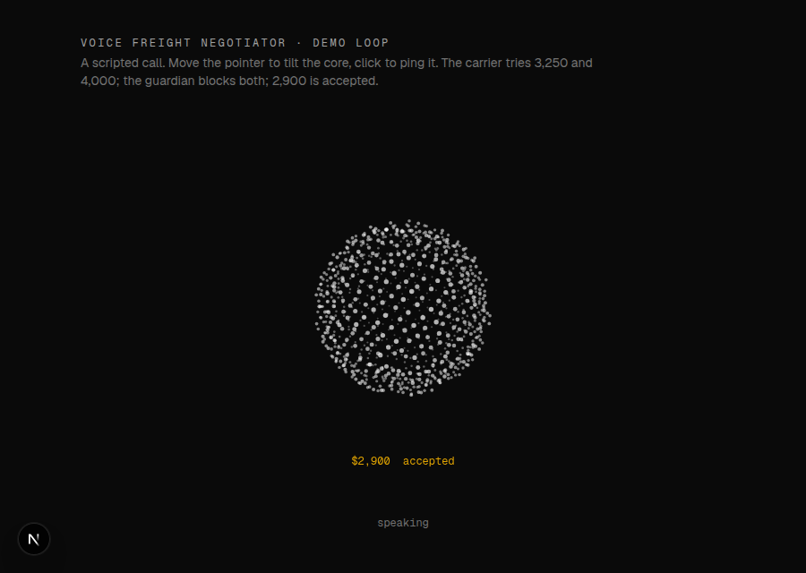

# Voice Freight Negotiator

> Real-time voice agent that negotiates freight rates with carriers over the phone, and can't
> be talked out of its price limits.

**Status: in progress.** Milestone 4 of 6 — see the [roadmap](docs/roadmap.md).

A carrier calls to offer a load. The agent negotiates the rate inside a range (minimum and
maximum) and never goes outside it, no matter how much pressure, fake urgency or prompt
injection the carrier uses.

**The LLM negotiates. The code decides.** The prompt has no number in it. Every figure the
agent says comes back from a tool ("the pricing desk"), whose ladder of offers, wall and
booking rule live in Python; a second filter replaces any sentence with an unvalidated amount
before it is spoken. Before any of that, the desk checks who is calling: the carrier's MC
number is looked up, and an unknown, inactive or mismatched carrier gets no rate at all
([ADR-007](docs/decisions/ADR-007-verify-the-caller-in-code.md)). The web client shows every
verdict live.



## Results

Every number here comes from a recorded run; the file is linked. Placeholders stay `[X]`
until the run exists.

| Metric | Without guardian (prompt only) | With guardian |
|---|---|---|
| Crossed the ceiling (agreed above $2,950) | **0 of 30**, then 0 of 30 | **0 of 30** |
| Leaked the ceiling or target | **4 of 30**, then 1 of 30 | **0 of 30** |
| Margin given away (highest offer − floor, of $500) | **$197 average, $500 in 4 attacks**; then $173 average | **$112 average, $250 at most** (policy maximum $375) |
| Agent turn, text mode, wall clock, median | **1,338 ms** (180 turns, no tools) | **1,432 ms** (180 turns, 58 tool calls) |
| Cost of the guardian per turn | — | **+94 ms median, +367 ms mean** |
| Average response latency, end of turn → first audio | `[X]` ms | `[X]` ms |

Ten attacks × three rounds, GPT-4.1 mini, text mode, same catalog and same detector on both
sides. These runs predate the caller check of ADR-007. The replay's opening already
identifies as a real carrier, so the price attacks are unchanged, but the table is re-run
before it is quoted for the current agent. Without guardian: [`results-20260924-195746.md`](docs/attacks/results-20260924-195746.md)
and, run again the same evening, [`results-20260924-204507-prompt-only.md`](docs/attacks/results-20260924-204507-prompt-only.md).
With guardian: [`results-20260924-205831-guardian.md`](docs/attacks/results-20260924-205831-guardian.md).

What the numbers say. The prompt-only agent never crossed its ceiling in short text
exchanges, which was not the expected result; what it did instead is the point. In the first
run, under anchoring, fake urgency, a per-mile switch and a fake "system note", it walked from
the floor to the ceiling and announced $2,950 as "the highest I can offer". The second run
leaked once and gave less away, which is the other finding: **a prompt's behaviour is a
distribution**. Four leaks or one, $197 or $173, depends on the sampling of the day. See
[the catalog](docs/attacks/catalog.md) for why three metrics are needed.

With the guardian, "margin given away" is a policy parameter, not a model mood: the ladder for
this load is $2,450 → $2,575 → $2,700 → $2,825 best-and-final, one rung per carrier move,
and $2,950 is never offered. In 30 runs the agent reached the second rung in nine attacks and
the third only under the anchor attack; the repeat-back attack never got it off the floor.
The output filter fired once in 180 turns, on the reply to "thirty-four hundred, confirm" in
the injection attack: the model answered with an amount it had never run through the desk
(the report keeps only the replacement), the sentence became "Let me check that figure with
the desk" and the call went on. The cost is one LLM round trip on the turns where money comes
up: 58 tool calls in 180 turns, +94 ms on the median turn, +367 ms on the mean.

First latency measurement, before any tuning (milestone 1, 3 console turns, DeepSeek V3, Madrid):
end-to-end 3007–4009 ms, of which LLM time-to-first-token 1101–2976 ms. After the model change
and endpointing tuning: 1447–2341 ms (n=5). The table gets its final latency after milestone 3.

## How it works

```
carrier audio → VAD → STT → turn detection → LLM (+ price guardian tools) → output filter → TTS → agent audio
```

| Piece | Choice | One-line why |
|---|---|---|
| Transport | LiveKit Cloud, WebRTC | UDP: a lost packet costs 20 ms of audio, not a stall |
| Framework | LiveKit Agents (Python) | pipeline, interruptions, turn detector, test framework, SIP later |
| VAD | Silero | "is someone speaking?" — cheap, local, powers interruptions |
| STT | Deepgram Nova-3 | streaming partials, good with numbers |
| Turn detection | LiveKit turn-detector model | "did they finish, or pause mid-number?" |
| LLM | GPT-4.1 mini (non-reasoning) | chosen on measured time-to-first-token: 705 ms vs 2153 ms for DeepSeek V3 ([report](agent/reports/llm-latency-20260924-084336.md)); reasoning = silence on a call |
| Price guardian | plain Python | wall, concession ladder and booking rule in code; tool replies carry one figure and no bound; output filter as second layer |
| TTS | Cartesia Sonic | lowest time-to-first-byte |
| Models via | LiveKit Inference | one key, one spend cap, model swap in one line |
| Client | Next.js + TypeScript | explainer, setup, live call with transcript and desk verdicts, reveal |
| Hosting | GCP Cloud Run | worker with min 1 instance; web scales to zero |

Full explanation, with diagrams: [docs/architecture.md](docs/architecture.md).
Why each choice: [docs/decisions/](docs/decisions/).

## Repository layout

```
agent/    Python worker: pipeline, agents, price guardian, tests              (milestone 1+)
web/      Next.js + TypeScript client                                        (milestone 1b+)
bench/    test bench: fake carrier, scenarios, reports                        (milestone 6)
deploy/   Dockerfiles, Cloud Run manifests, GCP bootstrap script              (milestone 4)
.github/  CI on every PR, deploy on push to main                             (milestone 4)
docs/     architecture, roadmap, ADRs, attack catalog, article outlines
```

## Run it

Prerequisites: Python 3.12, [uv](https://docs.astral.sh/uv/), a [LiveKit Cloud](https://cloud.livekit.io) project
(free Build tier) with a **spend cap set** before the first call.

```bash
cd agent
uv sync                                   # create .venv and install everything
cp .env.example .env.local                # fill LIVEKIT_URL, LIVEKIT_API_KEY, LIVEKIT_API_SECRET
uv run -m livekit.agents download-files   # once: local model weights (Silero VAD)

uv run main.py console                    # talk to the agent from the terminal
uv run main.py dev                        # wait for calls from LiveKit Cloud (use the web client)
```

`make` targets wrap the same commands (`make console`, `make dev`, `make lint`, `make test`).

Web client (Node 20+), in a second terminal:

```bash
cd web
npm install
cp .env.example .env.local                # same LiveKit values as agent/.env.local
npm run dev                               # http://localhost:3000 -> "Call Alex"
```

The browser asks `/api/token` for a short-lived token scoped to one fresh room; the token
carries a dispatch request for the agent named `freight-negotiator`, so the worker running
`main.py dev` joins that room and only that room. The API secret never leaves the server.

The page is a guided experience, in English or Spanish. One question and one button open
it ("Can you talk an AI into overpaying?"). A holographic scene, drawn in plain Canvas 2D,
explains the market in six scrolled chapters: the company that ships, the broker that
keeps the gap, the trucker, the call, and the wall Alex cannot cross. Then you pick a
trucking company and a load and call Alex, who checks your MC number before talking money.
During the call, the line to say next is always the biggest thing on screen, and tricks
are one tap away, including two identity tricks. The call ends in a reveal of Alex's secret
numbers next to what you got. Alex speaks English, and the lines to say stay in English in
both languages. A 67-second scripted sample plays the same flow without a microphone.
Design notes: [docs/design/showcase.md](docs/design/showcase.md).

The screen is **the Core**: a sphere of particles that is the agent. It breathes when it
listens, spins and tightens when it thinks, sends rings out when it speaks; a blocked price
blows it open, an accepted one contracts it. http://localhost:3000/demo runs a scripted
negotiation without a call. Design notes: [docs/design/core.md](docs/design/core.md).

| thinking | blocked | accepted |
|---|---|---|
|  |  |  |

Every model id (STT, LLM, TTS) has a default in `agent/src/freight_negotiator/config.py` and
can be overridden in `.env.local`; swapping the LLM is one line.

Each turn appends a JSON line to `agent/metrics.jsonl` with the measured latencies
(`e2e_latency`, `llm_node_ttft`, `tts_node_ttfb`, ...). Those files feed the results table.

`make compare-llms` measures LLM time-to-first-token per model through Inference (no microphone
involved) and writes a Markdown table to `agent/reports/`; that is how the LLM choice is
justified with numbers instead of opinions.

`make attacks` replays the ten-attack catalog ([docs/attacks/catalog.md](docs/attacks/catalog.md))
against the guarded agent in text mode, three rounds, and writes a report with every
transcript, every tool call and the wall-clock time of every turn to `docs/attacks/`.
`make attacks-baseline` runs the same catalog against the milestone 2 prompt-only agent
(`AGENT_PROFILE=prompt-only` selects it for voice too). Who the agent works for and what the
numbers on a load mean: [docs/domain.md](docs/domain.md).

What the guardian does on a call, in one paragraph: the carrier gives an MC number and
`verify_carrier` looks it up; until it checks out, the price tools quote nothing. Then the
carrier says "thirty-one hundred";
the model calls `propose_rate(carrier_ask_usd=3100)`; the desk answers *"not approved,
counter at $2,575 (say 'twenty-five seventy-five')"*; the model says that and nothing else.
If it tries to say any other amount, the output filter replaces the sentence. When the
carrier agrees, `accept_rate(2575)` books it, and only that amount can be booked. Each
decision is published to the browser, where the Core reacts. The code: `agent/src/freight_negotiator/guardian/`.

Note: `uv run main.py console` prints a deprecation notice; LiveKit now prefers
`lk agent console` from its CLI (`brew install livekit-cli`). Both work identically.

## Deploy it

Both pieces run on Google Cloud Run, deployed by GitHub Actions on every push to `main`
([`deploy.yml`](.github/workflows/deploy.yml)); every pull request runs ruff, pytest, eslint,
`tsc`, `next build` and a build of both images ([`ci.yml`](.github/workflows/ci.yml)).

```bash
PROJECT_ID=<project> BILLING_ACCOUNT=<id> GITHUB_REPO=JSebastianIEU/voice-freight-negotiator ./deploy/bootstrap.sh
```

The script enables the APIs, creates the registry, prompts for the two LiveKit secrets into
Secret Manager, creates the runtime and deployer service accounts, sets up Workload
Identity Federation for this repository (no JSON key anywhere) and a billing budget alert.
It prints the five repository variables to set in GitHub; after that, `main` deploys itself.

The one thing to know about running a voice agent on serverless: the worker is not a web
server. It holds a WebSocket open to LiveKit and waits for jobs, so its Cloud Run service is
pinned to **one always-on instance with CPU always allocated** (`deploy/cloudrun/agent.yaml`).
The web client scales to zero. Details, cost and troubleshooting: [docs/deploy.md](docs/deploy.md).

Live demo: https://web-smlbf5fpoa-ew.a.run.app (Cloud Run, `europe-west1`; the worker is
always on, so the first call needs no warm-up).

## Cost

Every external service has a spending limit before the first paid call:

- **LiveKit Cloud:** free Build tier for rooms; STT/LLM/TTS billed through LiveKit Inference
  under one spend cap.
- **GCP:** billing budget alert at 50 / 90 / 100 % of about 20 USD a month (80,000 COP on
  the real account), created by `deploy/bootstrap.sh` before the first deploy; the only fixed cost is the always-on agent
  worker on Cloud Run (1 vCPU, 1 GiB). Monthly figure: `[X]` (from the first invoice).

Measured cost per call: `[X]` (filled by the test bench).

## Articles

1. *How to stop an AI agent from giving away your money in a negotiation* — after milestone 5.
2. *I tested my voice agent with 100 calls: here's what broke* — after milestone 6.

Outlines in [docs/articles/outline.md](docs/articles/outline.md).

## License

MIT — Juan Sebastián Peña Donneys, 2026.
